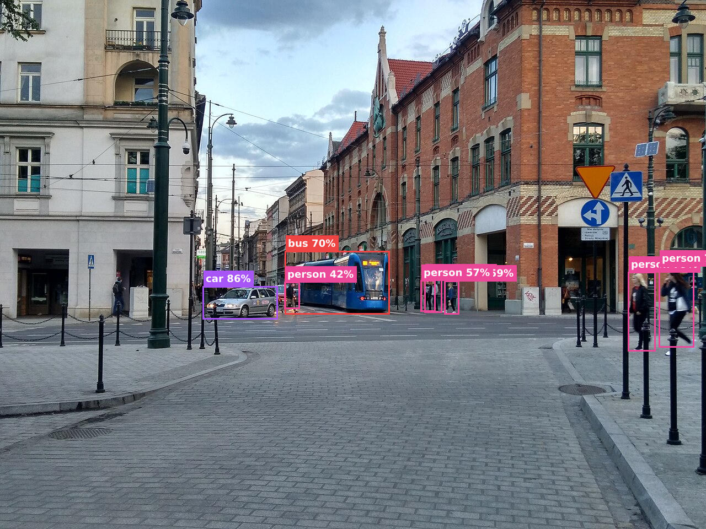

# CV Inference (Rust + YOLO + ONNX)

Object detection in Rust built around a pre-trained **YOLO11** ONNX model run
via **ONNX Runtime**. It's organised as a small reusable detection library with
two front-ends on top:

- 🌐 a **REST API** (Axum) that returns detections as JSON, and
- 🖼️ an **`annotate` CLI** that draws the detected boxes onto an image.

The focus is *backend integration* of a computer-vision model — model loading,
image preprocessing, ONNX inference, and detection post-processing — rather than
ML model training.

## Demo



Boxes and labels above were drawn by the bundled `annotate` tool from the
service's own detections. Regenerate it (or annotate any image) with:

```bash
cargo run --release --features draw --bin annotate -- path/to/image.jpg out.jpg
# or reproduce the demo above:
./scripts/demo.sh
```

<sub>Sample photo: [Wikimedia Commons](https://commons.wikimedia.org/wiki/File:Crossing_marked_with_a_traffic_sign_20190517_184744_HDR.jpg) (CC0).</sub>

## Quick start

```bash
# 1. download the model (~11 MB) into models/
./scripts/get_model.sh

# 2. build (the first build also downloads & statically links ONNX Runtime)
cargo build --release

# 3. run
./target/release/cv-inference
# listening on http://0.0.0.0:8080
```

In another terminal:

```bash
curl -F "file=@cat.jpg" http://localhost:8080/detect
```

```json
{
  "objects": [
    {
      "class": "person",
      "confidence": 0.97,
      "bbox": { "x": 124.0, "y": 80.0, "width": 200.0, "height": 450.0 }
    }
  ]
}
```

## Documentation

- [Architecture](docs/architecture.md) — design, project layout, inference pipeline, logging
- [API reference](docs/api.md) — endpoints, request/response formats, errors
- [Configuration](docs/configuration.md) — model download, `config.yaml`, environment variables
- [Deployment](docs/deployment.md) — local build & run, Docker
- [Roadmap](docs/roadmap.md) — planned / future improvements
